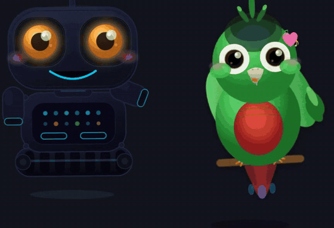
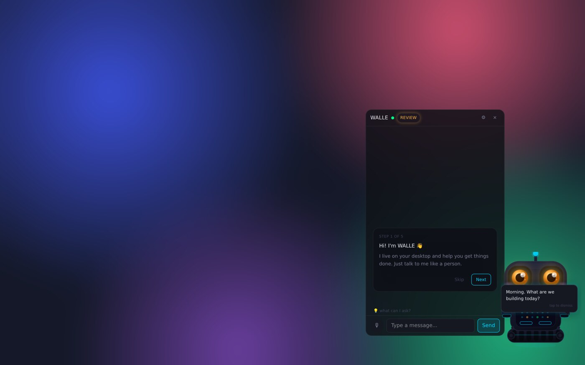
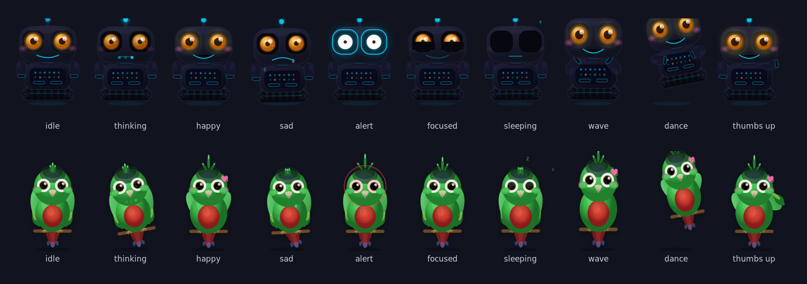

<h1 align="center">WALLE</h1>

<p align="center">
  <b>A little desktop companion that lives in the corner of your screen.</b><br>
  Talk to it, and it chats back, runs things on your computer, and reacts with a face, a bounce and a sound.
</p>

<p align="center">
  
  
  
  
  
</p>

<p align="center">
  
</p>

WALLE is a desktop AI companion built with Tauri v2, Rust and React. A mascot sits in the bottom-right corner of your screen, always on top. Open the chat with **Ctrl+Shift+Space**, ask it to open an app or check your git status, and the mascot answers in a speech bubble with a face to match.

> **Status:** an early experiment from March 2026, no longer in active development. The code works and the ideas are all here, so feel free to poke around.

<p align="center">
  
</p>

## Meet the mascots

Two characters, and you can switch between them in Settings without restarting:

- **WALLE**, a small robot on tracks with glowing eyes and an antenna.
- **DuDu**, a green parrot on a perch.

Each has **7 emotions** (idle, thinking, happy, sad, alert, focused, sleeping) and a set of one-shot **animations**: wave, dance, thumbs up, confused, excited run, stretch, and a reaction when you click to pet it. The AI picks an emotion for every reply, and the animations play on events: a dance or thumbs up when a task works, a confused shrug when it doesn't.

<p align="center">
  
</p>

- **Sound effects.** Each animation has its own little sound, synthesized live with the Web Audio API, so there are no audio files. DuDu chirps in syllables when it talks. Sounds can be turned off in Settings.
- **Speech bubbles.** Replies and greetings pop up above the mascot, with lines for the time of day, finished and failed tasks, and idle moments.
- **Alive when idle.** It drifts a few pixels now and then, and stretches when it wakes from sleeping. Drag it anywhere and it remembers where you left it.

## What it can do

| Area | What it does |
|------|--------------|
| **Chat** | A floating chat panel with push-to-talk voice input and conversation history saved in SQLite |
| **Actions** | Runs shell commands, launches apps, shows notifications, and runs saved multi-step workflows |
| **Safety** | Every action is rated safe, moderate or dangerous before it runs. Manual review mode asks you first, and a trust score per action learns from what you approve |
| **Context** | Can add the active window title and a clipboard preview to the prompt (both optional) |
| **Memory** | Remembers lasting preferences about you, stored locally |
| **Schedules** | Cron schedules that fire actions in the background |
| **Show your work** | A panel that narrates each step as it happens |
| **Developer mode** | Detects the git repo from the window title and reads its status, log and diff |
| **Learning** | Spots actions you repeat and suggests automating them |
| **Proactive nudges** | Background watchers that suggest things, with limits built in so they don't nag |
| **Plugins** | Built-in plugins you can switch on and off, external plugin manifests in `~/.walle/plugins`, and a marketplace search |
| **Insights** | A dashboard of usage, trust scores and saved memories |
| **Recorder** | Captures a session's steps into a list (early) |

**AI providers:** Anthropic, OpenAI, OpenRouter, or a local model through Ollama. API keys are kept in the OS credential store (via the `keyring` crate), never in the config file.

## Run it

**You need:** Windows 10/11 or macOS 11+, [Rust](https://rustup.rs/) stable, and Node.js 20+. On Linux, chat, shell commands and workflows work, but launching apps isn't wired up.

```bash
npm install
npm run tauri dev    # Vite + Tauri in development
npm run tauri build  # Desktop bundle (.msi on Windows, .dmg on macOS)
```

To build for a specific Mac chip (add the targets first with `rustup target add aarch64-apple-darwin x86_64-apple-darwin`):

```bash
npm run tauri build -- --target aarch64-apple-darwin   # Apple Silicon
npm run tauri build -- --target x86_64-apple-darwin    # Intel
```

If `tauri build` fails with a `--ci` flag error, try `CI= npm run tauri build` (Git Bash) or unset `CI`.

**First run:** a setup window asks for your provider's API key. To change it later, open the chat and click the gear.

## Hotkeys

| Shortcut | Action |
|----------|--------|
| Ctrl+Shift+Space | Open or close the chat |
| Ctrl+Shift+V | Push to talk (from the chat) |
| Ctrl+Shift+W | Show your work |
| Ctrl+Shift+I | Insights dashboard |
| Ctrl+Shift+E | Cycle the mascot's emotions (with the mascot focused, for testing) |

## Configuration

Settings live in `walle.config.json`. On first launch the app copies the bundled default if there isn't one. The main sections:

- `mascot`: which character, position, scale, idle animation, wandering, sounds
- `agent`: `mode` (`auto` or `manual_review`), action delay
- `context`: include the active window and clipboard
- `show_work`: the narration panel
- `developer_mode`: repo detection and git status in the prompt
- `plugins.enabled`: for example `shell`, `app_launch`, `notify`, `git`
- `workflows`: saved multi-step workflows
- `memory`: memory settings

Schedules, memories, conversations and trust scores live in `memory.db` (SQLite, through `sqlx`) in the app data folder.

## Project layout

```
mascot.html, chat.html, setup.html,   one Vite entry per window
settings.html, insights.html
src/components/Mascot/                WALLE and DuDu, emotions, particles, speech bubble
src/lib/mascotSounds.ts               Web Audio sound effects
src/lib/riskClassifier.ts             safe / moderate / dangerous gating for actions
src/components/Chat/                  chat panel, action cards, show-your-work panel
src-tauri/src/agent/                  LLM calls, model routing, trust, learning, proactive watchers
src-tauri/src/commands/               shell, app launch, git, schedules, plugins, recorder, marketplace
src-tauri/src/memory/                 SQLite memory store
```

## Platform notes

- **Shell commands** use PowerShell on Windows and `zsh -c` on macOS.
- **macOS:** the active window is read with AppleScript (`osascript` and System Events), apps open with `open -a`, and the mascot window uses `NSFloatingWindowLevel` so it stays above normal windows. The bundle uses `entitlements.plist` for WebKit.

## License

[MIT](LICENSE)
